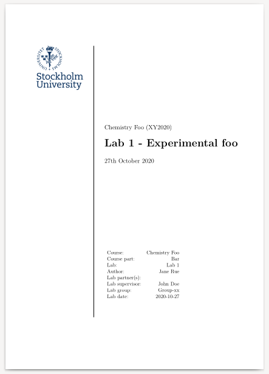

# Lab report template

## Installation

```bash
git clone https://github.com/mewmew/labreport ~/texmf/tex/latex/labreport
git clone https://github.com/mewmew/lstlangs ~/texmf/tex/latex/lstlangs
```

## Examples

An example lab report is located in [examples/lab1/](examples/lab1/). Use `make` to build the lab report (requires `latexrun`).


